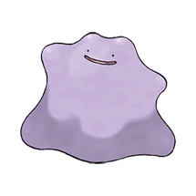

# Pokemon

## Welkom
hallo, mijn naam is Luka en dit is mijn website.

## Bulbasaur 001

## Ivysaur 002

## Venusaur 003

## Charmander 004

## Charmeleon 005

## Charizard 006

## Squirtle 007

## Wartortle 008

## Blastoise 009

## Caterpie 010

## Metapod 011

## Butterfree 012

## Weedle 013

## Kakuna 014

## Beedrill 015

## Pidgey 016

## Pidgeotto 017

## pidgeot 018

## Rattata 019

## Raticate 020

## Spearow 021

## Fearow 022

## Ekans 023

## Arbok 024

## Pikachu 025

## Raichu 026 

## Sandshrew 027

## Sandslash 028

## Nidoran 029

## Nidorina 030

## Nidoqueen 031

## Nidoran 032

## Nidorino 033

## Nidoking 034

## Clefairy 035

## Clefable 036

## vulpix 037

## Ninetales 038

## Jigglypuff 039

## Wigglytuff 040

## Zubat 041

## golbat 042

## Oddish 043

## Gloom 044

## Vileplume 045

## Paras 046

## Parasect 047

## Venonat 048

## Venomoth 049

## Diglett 050

## Dugtrio 051

## Meowth 052

## Persian 053

## Psyduck 054

## Golduck 055

## Mankey 056

## Primeape 057

## Growlithe 058

## Arcanine 059

## Poliwag 060

## Poliwhirl 061

## poliwrath 062

## Abra 063

## Kadabra 064

## Alakazam 065

## Machomp 066

## Machoke 067

## Machamp 068

## Bellsprout 069

## Weepinbell 070

## Victreebel 071

## Tentacool 072

## Tentacruel 073

## Geodude 074

## Graveler 075

## Golem 076

## Ponyta 077

## Rapidash 078

## Slowpoke 079

## Slowbro 080

## Magnemite 081

## Magneton 082

## Duduo 083

## Dodrio 084

## Seel 085

## Dewgong 086

## Grimer 087

## Muk 088

## Shellder 089

## Cloyster 090

## Gastly 091

## Haunter 092

## Gengar 093

## Onix 094

## Drowzee 095

## Hypno 096

## Krabby 097

## Kingler 098

## Voltorb 99

## Electrode 100

## Exeggcute 101

## Exeggutor 102

## Cubone 103

## Marowak 104

## Hitmonlee 105

## Hitmonchan 106

## Lickitung 107

## Koffing 108

## Weezing 109

## Rhyhorn 110

## Rhydon 111

## Chansey 112

## Tangela 113

## Kangaskhan 114

## Horsea 115

## Seadra 116

## Goldeen 117

## Seaking 118

## Staryu 119

## Starmie 120

## Mr.Mime 121

## Scyther 122

## Jynx 123

## Electabuzz 124

## Farfech´d 125

## Magmar 126

## Pinsir 127

## Tauros 128

## Magikarp 129

## Gyarados 130

## Lapras 131

## Ditto 132

## Eevee 133

## Vaporeon 134

## Jolteon 135

## Flareon 136

## Porygon 137

## Omanyte 138

## Omastar 139

